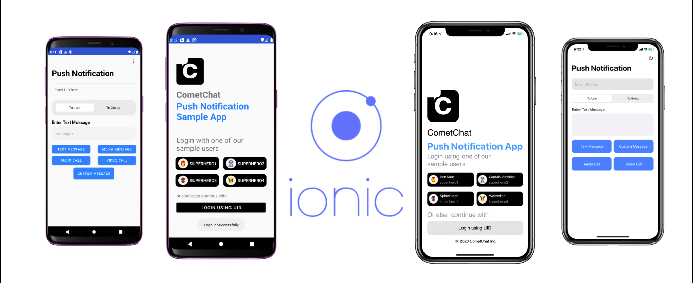

# Token-based Push Notifications Sample App

This Sample app will guide you to setup Push Notifications in your Ionic application.



## Pre-requisite
1. Login to the <a href="https://app.cometchat.io/" target="_blank">CometChat Dashboard</a>.
2. Select an existing app or create a new one.
3. Go to "API & Auth Keys" section and copy the `REST API` key from the "REST API Keys" tab.
4. Go to the "Extensions" section and Enable the Push Notifications extension.
5. Go to the "Installed" tab in the same section and open the settings for this extension and Set the version to `V2`.
6. Paste the `REST API Key` in the Settings.
7. Go to <a href="https://console.firebase.google.com/" target="_blank">Firebase Console</a> and get the Server Key for your app. Paste the Server Key in the settings and click on save.
7. Copy your app's `APP_ID`, `REGION` and `AUTH_KEY` from the Dashboard. These will be required in the next steps.

## Usage

1. Clone this repository.
2. Navigate to the `src` directory and replace `APP_ID`, `REGION` and `AUTH_KEY` with yours in `src/consts.ts` file.
3. Go to <a href="https://console.firebase.google.com/" target="_blank">Firebase Console</a> and get your `google-services.json` and `GoogleService-Info.plist`.
4. Place the `google-services.json` in android/app folder. Place the `GoogleService-Info.plist` in ios/App folder.
5. Install dependencies using `npm install`.
6. Run the following commands:
```
ionic build
npx cap sync
npx cap copy
```
8. To run your Android app, execute `npx cap open android`.
9. To run your iOS app, execute `npx cap open ios`.
10. Please make sure you have followed all the steps mentioned for the <a href="https://capacitorjs.com/docs/guides/push-notifications-firebase" target="_blank">Capacitor Plugin</a>.

---

## Documentation

<a href="https://prodocs.cometchat.com/docs/extensions-enhanced-push-notification" target="_blank">Token-based Push Notifications</a>